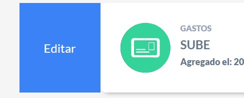
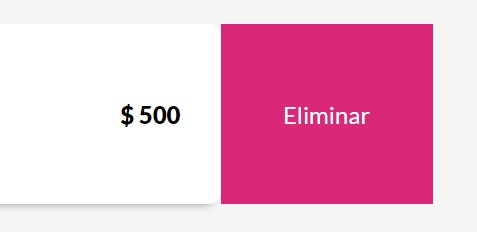

# App Presupuesto

Aplicación con React para manejar el presupuesto agregado por el usuario [Link del deploy](https://distracted-aryabhata-26ea5b.netlify.app/).

Cada tarjeta se puede deslizar hacia un la derecha o izquierda, según la acción que desee el usuario realizar, ya sea editar el gasto o eliminar el mismo.

